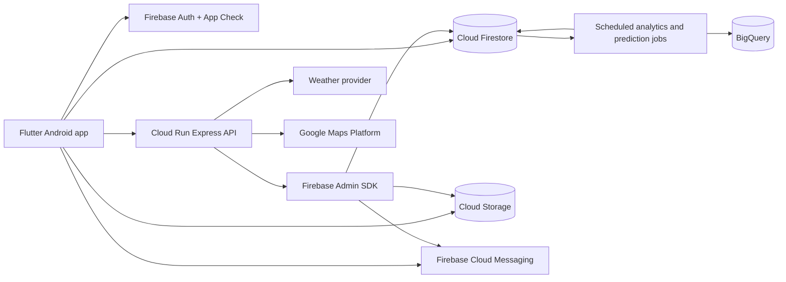

# Architecture

## Principles

- Feature-first Flutter modules with domain boundaries
- Riverpod providers as dependency injection and state orchestration
- Repository interfaces separating UI from Firebase and REST
- Firestore listeners for user-facing real-time reads
- Express API for privileged commands, cross-document transactions, claims,
  notifications, audit logs, analytics aggregation, and external integrations
- Deny-by-default security rules and server-issued role claims
- Append-only timelines and audit events for operational traceability

## Runtime topology



## Client modules

```text
lib/
  app/                  App bootstrap, routing, session
  core/                 Theme, localization, config, accessibility
  domain/               Stable business entities and repository contracts
  data/                 Firebase, REST, cache, and demo implementations
  features/
    auth/
    home/
    outages/
    map/
    complaints/
    notifications/
    saved_locations/
    provider/
    technician/
    admin/
  shared/               Reusable visual components
```

## Data flow

1. Firebase Auth produces an ID token with server-managed custom claims.
2. App Check protects callable backends and Firebase resources.
3. User-facing queries subscribe directly to Firestore for low-latency updates.
4. Privileged mutations call the REST API with an ID token and idempotency key.
5. The API validates input, checks role and tenancy, commits a transaction,
   writes an audit event, then publishes FCM notifications.
6. Firestore listeners update affected clients without polling.

## Scalability

- Store normalized area IDs and geohashes, not arbitrary address strings.
- Partition operational queries by `providerId` and status.
- Paginate by stable `(createdAt, documentId)` cursors.
- Keep unbounded events in subcollections; do not grow arrays indefinitely.
- Fan out notifications through topics and task queues, not API request loops.
- Export analytics events to BigQuery and serve pre-aggregated dashboards.
- Run AI inference asynchronously and publish versioned risk snapshots.

## AI boundary

Prediction output belongs in `riskPredictions/{predictionId}` with:

- `modelVersion`
- `areaId`
- `riskScore` from 0 to 1
- `drivers`
- `validFrom` and `validUntil`
- `generatedAt`
- `dataFreshness`

Predictions are advisory. They must never automatically disconnect service,
close complaints, or dispatch emergency work without human confirmation.
